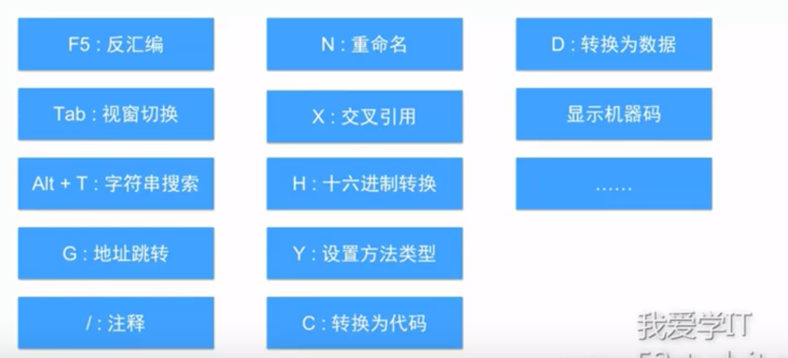

#把.m 编译成 c 
```
$xcrun -sdk iphoneos clang -rewrite-objc -F Foundation -arch armv7 main.m
```
#class-dump 
- [class-dump](https://juejin.im/post/5bd27205f265da0abd355fcc)
- 简介：class-dump 是一个工具，它利用了 Objective-C 语言的运行时特性，将存储在 Mach-O 文件中的头文件信息提取出来，并生成对应的 .h 文件。
- 只能导出OC的哦。我安装有MonkeyDev，他安装了classdump.通过which class-dump获得安装路径为:
```
$which class-dump 
=>/opt/MonkeyDev/bin/class-dump
```
- 用法
```
$class-dump -H MachO文件Path -o 导出头文件需要存放路径
$class-dump -H WeChat -o ~/Desktop/wechatHeader
```
#ASLR (Address Space Layout Randomization)
- [小黄书第93页](http://theiphonewiki.com/wiki/ASLR)
- 每次进程启动时，同一进程的所有模块在虚拟内存中的起始地址都会产生随机偏移
- 但是他的大小是不会变的
- 可以在LLDB下使用 image命令拿到本次的ASLR地址 
  ```
  $image list -o -f
  ```
- IDA,Hopper 反汇编出来的是 基地址 也就是没有偏移前的地址
  - 偏移后模块基地址 = 偏移前模块基地址 + ASLR偏移
  - funcA的偏移后的地址 = 偏移前符号地址 + ASLR偏移
  - 比如NiXaingDemo中的 aslr = 0x00000000029bc000   
  [ViewController loadrequest]偏移后的Address = 00000001000068d0 + 0x00000000029bc000 
  = 0x1029c28d0
  lldb中在 0x1047da924 下断点 br s -a 0x1029c28d0
  [BeiNiClass beiNiFunction7] 偏移后的Address = 0000000100006864 + 0x00000000029bc000 
  =0x1029c2864 下断点 br s -a 0x1029c2864

#Theos
1. /opt/theos/bin/nic.pl -> 选择模块创建项目 一般是Tweak 写代码
2. make 把当前的工程编译一下
3. make package后会生成一个deb包
4. make install安装 ，会把安装包拷贝到手机上，需要连接到手机  exprot THEOS_DEVICE_IP = 10.2.198.1.23 再 make install
##logify.py
在 ~/.bash_profile 文件下 添加 alias logify="/opt/theos/bin/logify.pl"
- logify 头文件path (> tweak.xm路径)【这个是写入文件的可以不加】

#CaptinHook
- [wiki](https://github.com/rpetrich/CaptainHook/wiki)
- 提供了一系列方法用来hook NSObject
```
CHDeclareClass
CHOptimizedMethod
CHConstructor{
    CHLoadLateClass
    CHHook
    CHClassHook
    CHDeclareMethod//添加新方法
    CHPropertyRetainNonatomic//添加新属性
}
```

#yololib
- yololib 可执行文件path dylibpath
- /usr/local/bin/yololib "$TARGET_APP_PATH/$APP_BINARY" "Frameworks/${fram}.framework/${fram}"
- /usr/local/bin/yololib "$TARGET_APP_PATH/$APP_BINARY" "${dyli}.dylib"

#otool
- otool -l exec | grep crypt 查看文件加密信息
- otool -L yourApp.app/yourApp 查看Mach-O(可执行二进制文件)引用的framework与dylib
- otool -h + 文件名  //查看头部
- otool -hv + 文件名
- otool -s __TEXT __text xxx //二进制
- otool -tv xxx｜head -n 10 //可视化

#install_name_tool 动态库的依赖动态库路径修改工具
- /Applications/Xcode.app/Contents/Developer/Toolchains/XcodeDefault.xctoolchain/usr/bin/install_name_tool [-change old new] ... [-rpath old new] ... [-add_rpath new] ... [-delete_rpath old] ... [-id name] input
- -change 修改依赖路径
- -id 修改动态库本身的install_path
- 扩展知识点
  - install Name 本质是一个路径，告诉连接器在运行时在哪里找到需要的库
  - @executable_path 这个变量表示可执行程序所在的目录
  - @loader_path 这个变量表示每一个被加载的 binary (包括可执行程序, dylib, framework 等) 所在的目录. 在一个进程中, 对于每一个模块, @loader_path 会解析成不用的路径, 而 @executable_path 总是被解析为同一个路径(可执行程序所在目录).
  - @rpath 将告诉动态链接器去本地的列表搜索这个库。

#lipo
- lipo -info QQKSong 查看二进制文件信息 => QQKSong are: armv7 arm64 
- lipo QQKSong -thin arm64 -output ../arm64 => 提取arm64架构
- lipo -create thin_onew thin_two -output fat

#Hopper Disassembler
- 理论知识:能通过 Mach-O 做代码分析代码的一个重要原因就是机器语言可以反推成汇编语言，是可逆的。原因就是在同一种架构平台下，每一条汇编指令都有与之对应的唯一的机器指令，这种反推行为一般叫反编译。但是 汇编语言不能百分百反推oc等高级语言，因为有些不同但相似的代码，编译成汇编语言是一模一样的。比如具有相同元素的结构体和数组，编译后汇编语言就是一样的。所以说不能百分百还原，但是因为部分代码还是相似的，所以还是可以看个大概的。下面就借助 Hopper disassembler 工具将 Mach-O 文件的机器语言代码反编译成汇编代码、OC伪代码或者Swift伪代码。[参考](https://sharex.win/?p=125)
- 在左边的控制面板中，可以通过字符串搜索字段，函数名类名等等
- 控制面板上面的导航条不同颜色代表了不同的含义
  - 蓝色 部分表示代码(code)
  - 黄色 部分表示程序(procedure)
  - 绿色 部分表示ASCII字符串(string)
  - 紫色 部分表示数据(data)
  - 灰色 部分是不能识别的类型 红色小箭头表示当前你的光标所在的位置
  - 一旦一个可执行文件被加载入Hopper，你就可以使用键盘或者界面上顶部的工具条改变它的类型。
- 导航条上面 Transformations 上的 DACPU 此工具条包含了你能设置的（D即Date，A即ASCII，依此类推）类型按钮，这些字母同样也有快捷键，你可以直接通过快捷键直接进行类型转换。 Date类型有一些具体的表示形式：比如当你第一次选择这个类型时，Hopper将这个你选择的一块区域转换为字节型，如果你再次选择它，这个字节将会被转换为一个16位的整数型，然后再是32位的整数型，依此类推。Hopper提供了一个“取消”／“重做”的功能，让你可以随意的去更改和探索可执行文件。
  - Data ：当Hopper认为数据中的一块区域表示常量的时候，这块区域将被设置为data（数据）类型。例如一段int数组，这样的情况就会被设置。
  - ASCII ： 一个以空值为终止的C字符串。
  - Code ：一个指令。
  - Procedure （程序）：一旦确定它是由Hopper重新构建的函数的一部分，则该字节接受该类型。
  - Undefined （无法识别）：这是目前为止还未被Hopper探索的一块区域。
  - D 按键不断点击，在汇编代码区会有不同的变化
- 再右边的 View Mode 的4个按钮代表了4种不同的显示方式依次为
- 显示模式
  - 汇编模式  
    - Hopper将一行一行的汇编代码，这是很多反汇编软件都提供的一种模式。
    - 第一栏（蓝色数字处）代表指令的地址位置。它在每条指令、操作元（或者寄存器）的最前端。作为一项选择，在应用的偏好设置中，你能选择在地址和伪指令（the instruction mnemonic）之间显示指令编码。
    - 在边缘，你能看到一些有眼色的箭头服务好。这些箭头代表指令可能跳转的位置。例如，在0x100002d82和0x100002db4地址之间的蓝色箭头代表了在0x100002d82的je指令如果满足je判断的条件，则跳转至0x100002db4这个位置。当这个指令跳转为向高地址（向下跳转）跳转时，则箭头为蓝色。如果这个指令向上（向低地址）跳转时，则箭头为红色。
    - 需要注意的是在左边两个竖条（红和蓝），如果你点击红色栏，你将在相应的地址设置一个断点，如果你点击蓝色栏，你将在相应的地址设置一个书签。
  - 控制浮动图表模式 
    - 控制浮动图表模式将程序以更具有结构化的方式显示出来。
    - 在此界面上你仍然可以进行编辑一些事项，比如备注和标签。鼠标可以从一个基础块移动到另一个基础块；简单地移动鼠标至当前的基础块上，使用你键盘上的方位键来跳转至最近的基础块。如果你按下向上或者向下的按键，鼠标光标将移至最近的基础块，不过请使用相同的栏目。同样，你按右键、左键也移到对应的位置。
    - 在右边的控制面板中（检测窗），你会发现存在该模式的总览图。控制浮动图表的组成展示了当前程序展示的一个整体缩略图，被称为“迷你图”。每一个方块代表一个基础块，其中的线表示它们之间的联系。在“迷你图”中，我们可以看到一个蓝色的基础块，基础块被填充为蓝色意味着光标的位置在此基础块中。在高亮灰色方块表示当前你所看到的控制浮动图表部分。你可以直接在这个“迷你图”中点击移动它。
    - 图表上的这些节点可以被修饰。例如，当你认为某块与某块具有密切联系时，可以对它们进行分组。选择这些节点并在“检测窗”点击“Group Nodes（组节点）”按钮。
    - 你也能给一个节点设置一个你常用背景色，或者插入一段文本。
  - 伪代码模式 
    - 在这个模式中，Hopper将尝试着生成一些“假”代码，功能上相当于原始的CPU指令，但是它们更像是Objective-C的函数。
    - 这种模式让你分析以及阅读更加容易，不过你需要记住的是这些并不是“魔法”，有时，它并不能够将构建一个该程序完美的“假”代码展现出来，并且有些部分可能不会显示出来。因为Hopper可能将它们定义为没有联系的代码（也称之为dead code），为了尽量的避免这个问题，你可以尝试在界面的上方切换相应复选框。
  - 十六进制模式
- 图表模式用红绿蓝三种线
  - 红色代表条件不成立时执行
  - 绿色代表条件成立
  - 代表执行

#IDA
- ida常用快捷键 

#/opt
1. 编译后把 binary 拖到 ~/Documents/bin 目录下
2. 在 ~/.bash_profile 文件下 添加 alias binary="~/Documents/bin"

# [acextract 导出 Assets.car的资源图片](https://github.com/bartoszj/acextract)
```
mkdir -p ~/AssetsOutput
acextract -i ~/Assets.car -o ~/AssetsOutput
```

# [restore-symbol 对bin进行符号还原](https://github.com/tobefuturer/restore-symbol.git)
1. 编译
```
cd restore-symbol && make 
```
2. 对OC方法进行符号还原
```
restore-symbol origin_mach_o_file -o mach_o_with_symbol 
```
3. 对block进行符号还原； 等IDA反编译完成后，把 ~/Documents/opt/ida_search_block.py 或者 ~/Documents/opt/restore-symbol/search_oc_block/ida_search_block.py cp到 待还原的bin目录下
4. 在IDA点File -> Script file, 选ida_search_block.py 会生成 一个 block_symbol.json 文件，下方的命令 -j 就是选json文件
```
restore-symbol origin_mach_o_file -o mach_o_with_block_symbol  -j block_symbol.json
```

# [ida-swift-demangle 一个ida脚本来解析swift函数名](https://github.com/tobefuturer/ida-swift-demangle)
1. 等IDA分析完成后 点File -> Script file，选 ~/Documents/opt/ida-swift-demangle.py 或者 ~/Documents/opt/ida-swift-demangle/ida-swift-demangle.py ，copy到ida分析的bin目录下比较好

# [frida-ios-dump 一键砸壳和查看进程id bundleid](https://github.com/AloneMonkey/frida-ios-dump)
1. 下载源码，切换分支 起别名 frida-ios-dump 
2. 连上手机 端口转发 并使用
```
$ iproxy 2222 22
$ frida-ios-dump -l  //查看所有的进程 可以用 grep 过滤
$ frida-ios-dump Display name or Bundle identifier  砸到电脑的下载目录
```

# [sbr 使用Python脚本强化LLDB调试器 例子](http://iosre.com/t/python-lldb/2060)
```
cd ~/Documents/opt
mkdir lldbScript
touch sbr.py
```
然后在 ~/.lldbinit 文件写下 command script import ~/Documents/opt/lldbScript/sbr.py 重启即可

# [LLDB别名/正则表达式和Python脚本的集合](https://github.com/DerekSelander/LLDB)
1. 下载源码 然后在 ~/.lldbinit 文件写下 command script import ~/Documents/opt/LLDB/lldb_commands/dslldb.py
   

#[Homebrew 用于管理 brew安装的命令行工具](https://brew.sh)
1. 使用 Homebrew 安装 Apple（或您的 Linux 系统）没有预装但 你需要的东西。
Homebrew 会将软件包安装到独立目录，并将其文件软链接至 /usr/local 。
Homebrew 不会将文件安装到它本身目录之外，所以您可将 Homebrew 安装到任意位置。
安装路径在 "/usr/local/Cellar" 下
可以用它来管理 cocoapods ruby python nodejs mysql 等
```
brew install node
brew install python  当然也可以用 Cakebrew GUIAPP
```
2. “要安装，请拖动此图标......”不会再出现了。使用 brew cask 安装 macOS 应用程序、字体和插件以及其他非开源软件。
brew cask 是一个用命令行管理 Mac 下应用的工具，它是基于 homebrew 的一个增强工具。
可以用它来管理 Mac 下的 Gui 程序，例如qq, chrome
```
brew cask install qq
brew cask install google-chrome
brew cask install evernote
```
